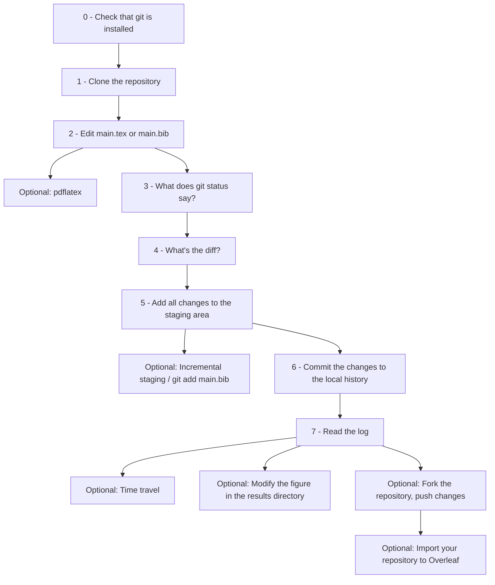

# LaTeX and git - ProHealth REU Summer 2022

## Abstract

A crash course in using `git` for document version control.
We'll motivate this as a method for keeping track of changes
in a $\LaTeX$ document over time, and use `git` repositories to
store research code.

## Introduction

**Slides** are online:

- https://hayesall.com/talks/managing-research/

> `git` : `GitHub` :: `LaTeX` : `Overleaf`
>
> `git` is to `GitHub` as `LaTeX` is to `Overleaf`

**Terminology**:

- [`git`](https://git-scm.com/): a tool that assists with *version control*—or tracking changes in files
- [`GitHub`](https://github.com/about): a website for hosting, sharing, and collaborating on `git` repositories
- [`LaTeX`](https://www.latex-project.org/): a collection of tools for editing and typesetting documents, built on the `TeX` language
- [`Overleaf`](https://www.overleaf.com/about): a website for hosting and collaborating on `LaTeX` projects

When you see a block like this:

```bash
git status
python -m dosomething
```

… it usually represents running a command in a [terminal emulator](https://en.wikipedia.org/wiki/Terminal_emulator).

<details>
<summary><b>Click here</b> for more notes on terminals</summary>

- **MacOS**: <kbd>⌘</kbd> + <kbd>spacebar</kbd> to open Spotlight, then search for "Terminal"
- **GNU/Linux**: <kbd>⊞</kbd> usually opens a search mode, look for "Terminal"
- **Chromebook**: A terminal is available after you [Set up Linux on your Chromebook](https://support.google.com/chromebook/answer/9145439?hl=en)
- **Windows**: There are several options
  - [Windows Terminal](https://apps.microsoft.com/store/detail/windows-terminal/9N0DX20HK701)
  - [PowerShell](https://docs.microsoft.com/en-us/powershell/scripting/install/installing-powershell-on-windows?view=powershell-7.2)
  - [Windows Subsystem for Linux (WSL)]((https://docs.microsoft.com/en-us/windows/wsl/about))
  - [Git Bash](https://gitforwindows.org/)
  - *Alexander's recommendation*: Start with "Git Bash," but eventually switch to the Windows Terminal.

</details>

---

## Activity

We'll explore the following flow chart:



(0) Check that `git` is installed

```bash
git --version
```

<details>
<summary><b>Click here</b> if something unexpected happens</summary>

- **MacOS**: *Should* know about `git`. It *might* say something like "You need to install Xcode," follow those prompts.
- **GNU/Linux**: *Should* ship with `git`. If it isn't available, use your system dependency manager (apt/yum/gulp, etc.)
- **Chromebook**: *Should* ship with `git`. If not, `apt install git`
- **Windows**:
  - [Git Bash](https://gitforwindows.org/) is the quickest option to get started, the default settings should be fine.
  - If you have the "Windows Terminal," install `git` with your preferred package manager
    - [Chocolately](https://chocolatey.org/)
    - [Windows Package Manager (winget)](https://docs.microsoft.com/en-us/windows/package-manager/)

</details>

---

(1) Clone the repository

```bash
git clone https://github.com/iuprohealth/reu-latex-git-tutorial.git
```

Then change your working directory:

```bash
cd reu-latex-git-tutorial
```

---

(2) Edit the `main.tex` file or the `main.bib` file with
a text editor.

---

<details>
<summary><b>(Optional): Build a copy of the PDF</b></summary>

If you have [`texlive`](https://www.tug.org/texlive/) or a TeX distribution installed, you can build a copy of the PDF:

```bash
pdflatex main
bibtex main
pdflatex main
pdflatex main
```

Overleaf is doing something comparable to this process in the background.

</details>


---

(3) What does the following command return?

```bash
git status
```

---

(4) View the *changes* (or the `diff`) from the previous state:

```bash
git diff
```

---

(5) Add all changes to the staging area

```bash
git add .
```

---

<details>
<summary><b>(Optional)</b>: Incremental Staging, add files in logical groups</summary>

You can add files to the staging area separately.
`git reset` will remove all changes from the staging area, but will
not alter file contents.

```bash
git add main.tex
```

</details>

---

(6) Commit the changes to the local history

```bash
git commit
```

By default: this will probably open a "Vi" prompt.

- Type (`i`) to enter "insert" mode to write your message
- Type (`:wq`) to save and exit

---

(7) Read the history in the log

The "git log" contains a complete copy of the history for a project. Running this:

```bash
git log
```

… should now show your contribution at the top, with all the previous contributions
below.

---

**(Optional): Time Travel**

Using git for time travel is controversial, but it's an intriguing feature to know about.

- Skim the documentation for the `git branch` subcommand: https://git-scm.com/docs/git-branch
- Skim the documentation for the `git checkout` subcommand: https://git-scm.com/docs/git-checkout
- Read about "*Branching Workflows*": https://git-scm.com/book/en/v2/Git-Branching-Branching-Workflows
- Read about "*Rewriting History*": https://git-scm.com/book/en/v2/Git-Tools-Rewriting-History

Copy the first seven characters from a commit hash:

```console
commit 01ec7e5304d51df30195f2b07dee2117ff145307           <----- This part
Author: hayesall <alexander@batflyer.net>
Date:   Mon May 23 18:03:46 2022 -0400

    📄 Add CC-BY-SA 4.0 LICENSE
```

What does checking out a hash do?

```bash
git checkout 01ec7e
```

If you're in a "detatched HEAD" mode, what happens to the log when you
start down a new branch?

```bash
git checkout -b my-version-of-history
```

---

**(Optional): Try to reproduce the figure, or modify it**

The `results/chicken_wing_plots.png` file is produced by
the `chicken_wings.csv` and the `plot_data.py` script.

```bash
pip install -r requirements.txt
python plot_data.py
```

Try something like:

1. Make a copy of the `chicken_wing_plots.png`. e.g.: `mv chicken_wing_plots.png chicken_wing_plots_backup.png`
2. Run the script
3. Are the two figures the same?
    - Do they look the same?
    - Do the figures contain exactly the same data? (see also: https://en.wikipedia.org/wiki/Md5sum)

Now try modifying the code or the data (`chicken_wings.csv`):

1. Add an additional line to the data
2. Remove some lines from the data

Improve the figure:

1. `matplotlib` can output `PDF` figures
2. Edit the Python script to produce a PDF image instead of a PNG image
3. Edit the `main.tex` document to use the new figure

---

**(Optional): Fork the repo and share your changes**

So far we've recorded changes to our *local* history. We can share our *local* changes by pushing them to a *remote* server.

- Read about "[Forking repositories](https://docs.github.com/en/get-started/quickstart/fork-a-repo)" in the GitHub documentation
- Fork this repository
- Change the "remote," swapping the `hayesall` with your GitHub username

```bash
git remote remove origin
git remote add origin https://github.com/hayesall/reu-latex-git-tutorial.git
```

Now push your local changes to your modified remote:

```bash
git push -u origin main
```

---

**(Optional): Import your repository into Overleaf**

---

## Homework

1. Write a reflection about the "Saving Data and Code" section
    - Did you learn something new? Do you have some prior knowledge about the topics?
    - Did you explore one of the [Optional] paths? If so, what did you learn? If not, what might be interesting to explore further?
    - Do you foresee incorporating this into your workflow?  What barriers, advantages, or disadvantages might occur?
2. Read the NeurIPS / PapersWithCode guide on "[Publishing Research Code](https://github.com/paperswithcode/releasing-research-code)." Summarize its main topics, AND pick one of the following topics to read further about:
    - How would you define the terms "reproducibility" and "replicability?" What does the phrase "the replicability crisis" mean? (You might find it helpful to express this in terms of the entire inquiry process from data collection, to analysis, to publication). Cite the sources you read.
    - There exist "Open Access Journals" where paper writing, reviewing, and publishing all occur in public. Find a paper that has already been reviewed and published and read the discussion between the authors, reviewers, and editors.(https://github.com/openjournals/joss-reviews/issues?q=is%3Aissue+is%3Aclosed+label%3Areview+). As an example, Alexander was a reviewer on this paper: https://github.com/openjournals/joss-reviews/issues/3465
      - (You don't have to share the exact paper you read if you do not want to). What requirements did the submission process require up-front? What did reviewers request?
      - What do you think about this process? Can you think of any advantages or disadvantages?
3. Fork this `reu-latex-git-tutorial` repository to your GitHub profile, and use Overleaf's "Import from GitHub." Include a link to your "fork" in your blog post.

---

## git Cheatsheet

**First-time setup**:

```bash
git config --global user.name "Your Name"
git config --global user.email "youremail@example.com"
```

**Commands**:

```bash
git clone [url]     # clone a repository from a remote destination
git add [file]      # add a file
git status          # what files are changed / staged / unstaged?
git diff            # what unstaged changes exist?
git commit          # tell (local) git about your changes
git push            # send your changes upstream
git remote -v       # what remote repository does git know about?
```

**Modify remote and push to a different upstream**

```bash
git remote remove origin
git remote add origin https://github.com/your-user/your-repo.git
git push -u origin main
```

## Bash/Terminal Cheatsheet

**Moving around**:

```bash
cd [directory]      # Change Directory: ``cd ~/Downloads/`
cd ..               # go "down" one directory
```

**Listing files**:

```bash
ls                  # List files in current directory
ls [directory]      # List files in another directory
```

**Other helpful tricks**

```bash
pwd                 # Present Working Directory: where am I?
exit                # Exit current session / close tab
(CTRL-l)            # Clear terminal screen
(CTRL-t)            # New tab
(up arrow)          # Last command
```

## Further Reading

### git

*If you read only one thing, read the blog post by Rachel M. Carmena*

- "[Pro Git](https://git-scm.com/book/en/v2)," Scott Chacon and Ben Straub (2nd Edition) (CC BY-NC-SA 3.0)
- "[How to teach Git](https://rachelcarmena.github.io/2018/12/12/how-to-teach-git.html)," Rachel M. Carmena
- "[Learn Git Branching](https://learngitbranching.js.org/)," (Interactive Tutorial)
- Tim Holy (video lecture), "[Open Source, Julia Packages, git, and GitHub](https://www.youtube.com/watch?v=cquJ9kPkwR8&list=PL-G47MxHVTewUm5ywggLvmbUCNOD2RbKA&index=2)"
- What is a commit message?
  - Message templates: https://github.com/joelparkerhenderson/git-commit-message
  - "gitmoji": An emoji guide for your commit messages: https://gitmoji.dev/
- GitKraken GUI + Git CLI: https://www.gitkraken.com/
- Visualizing GitHub Repositories: https://mango-dune-07a8b7110.1.azurestaticapps.net/?repo=iuprohealth%2Fhmc-dashboard

### LaTeX

- "The TeXbook," by Donald E. Knuth. http://visualmatheditor.equatheque.net/doc/texbook.pdf
- LaTeX + VSCode
  - LaTeX Workshop Extension: https://marketplace.visualstudio.com/items?itemName=James-Yu.latex-workshop
- "LaTeX/Bibliography Management," WikiBooks. https://en.wikibooks.org/wiki/LaTeX/Bibliography_Management
- KaTeX: LaTeX typesetting for the web
  - https://katex.org/
  - Typesetting equations: https://katex.org/docs/supported.html
- GitHub supports LaTeX math notation in Markdown (as of 2022-05-19):
  - https://github.blog/2022-05-19-math-support-in-markdown/

## License

<a rel="license" href="http://creativecommons.org/licenses/by/4.0/"></a><br />This work is licensed under a <a rel="license" href="http://creativecommons.org/licenses/by/4.0/">Creative Commons Attribution 4.0 International License</a>.
